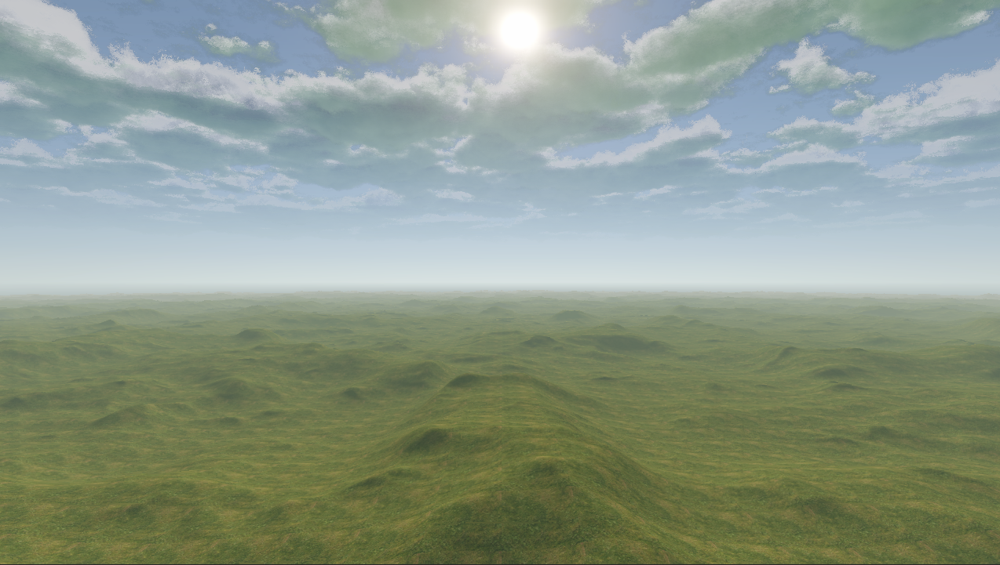
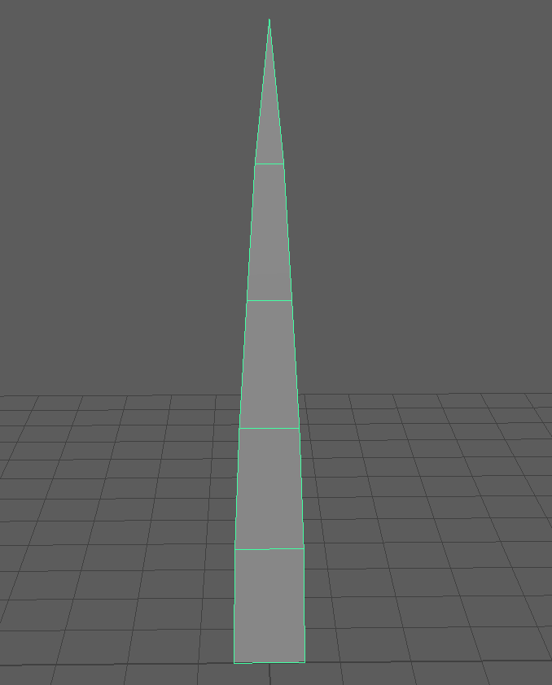
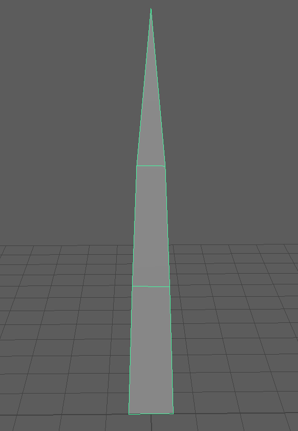
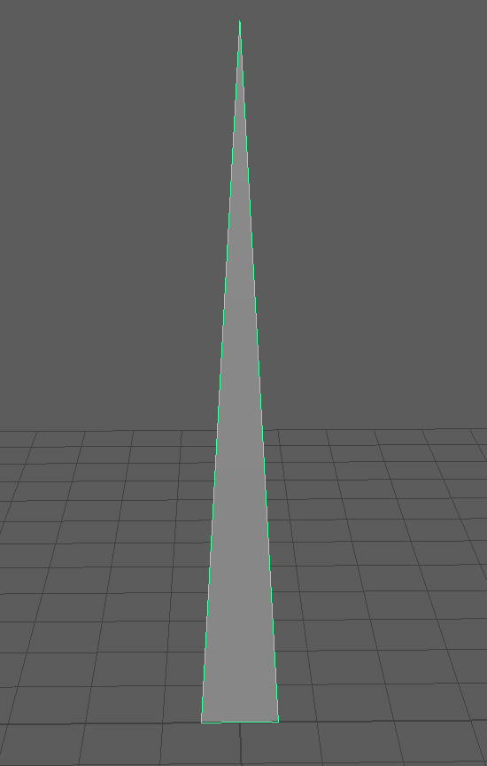
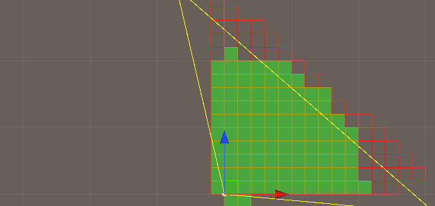
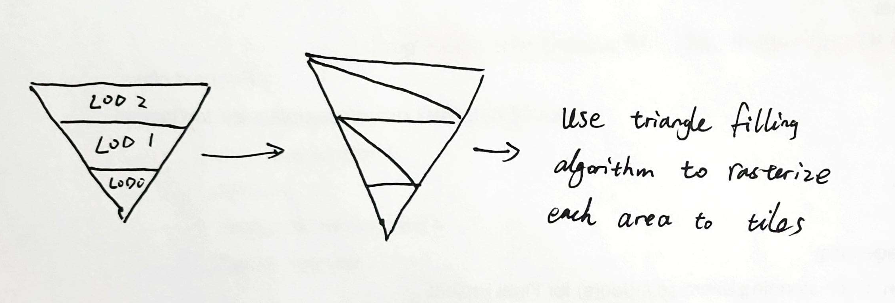

# Bliss
A Unity GPU Instancing Sample

https://github.com/IwakuraRein/Bliss/assets/28486541/5529f5c4-1e72-43e8-a2d2-8379ec44c87a

## Reference

- Clouds: [Rainforest by iq](https://www.shadertoy.com/view/4ttSWf)
- Terrain: [Asteroid Rover by demofox](https://www.shadertoy.com/view/Mds3DX)
- Grass blade physics: [Responsive Real-Time Grass Rendering for General 3D Scenes](https://www.cg.tuwien.ac.at/research/publications/2017/JAHRMANN-2017-RRTG/JAHRMANN-2017-RRTG-draft.pdf)

## Rendering

I use two blit passes to render the clouds and the terrain. They are generated by ray marching in the fragment shaders:



A grass blade is defined by 3 positions: V0, V1, and V2.


They are the Cubic Bezier control points. The positions of a grass blade's vertices are interpolated in the vertex shader.

Also, I prepared three three levels of detail (LOD) for grass blade models:

| LOD 0 (9 Triangles) | LOD 1 (5 Triangles) | LOD 2 (1 Triangle) |
|-------|-------|-------|
|   |   |      |

## Grass Generation

I partition the camera frustum into tiles using the scanline algorithm, and then use the compute shader to generate grass blades in each tile.



The compute shader determines the V0 and the orientation of the grass blades by blue noise, and updates V1 and V2 based on the force field. There is a global force field sampled from a perlin noise, and a local force field stored in grass blades' states. After the compute shader, `DrawMeshInstancedIndirect` is invoked 3 times (corresponding to the LOD) to render the grass blades.

The state of a grass blade is stored in a struct:

```c
struct GrassRenderProperty {
    float4 v0_world; // w is the random grass height multiplier
    float4 v1andv2_local; // x: v1.y uniformed by grass height; yw: v2's xz coordinates uniformed by grass width; z: v2's y coordinate uniformed by grass height
    float4 right; // the right direction of the blade.
    float4 color; // w is the blend factor
    float4 innerForce;
};
```

The compute shader writes to a buffer of `GrassRenderProperty`, which the vertex shader then reads to interpolate the vertex position and color.

## Interactivity

I also copied the ray marching codes to the CPU side to get the intersection position between the mouse and the terrain when the user clicks the mouse button. The intersection position is passed to the compute shader to update the grass blades' inner force and color states. As a result, the user's click action pushes the grass away and change its color.

https://github.com/IwakuraRein/Bliss/assets/28486541/1d69a8b6-b355-4573-8b8a-04f6c85493e1

## Future Work

### Better LOD

At present, all the tiles share the same size and generate the same amount of grass. It would be ideal to make the tiles that are far away larger and have less amount of grass. A potential approach is to divide the frustum into different areas and rasterize each with different tile size.



Additionally, the current CPU time for generating the tiles is non-negligible. It would be better to use the Job System or computer shader to speed up this process.

### Culling

There are many grass blades being blocked by the terrain so it is desirable to cull these invisible blades. A potential approach is to generate a Hi-Z buffer after rendering the terrain and accessing it in the compute shader. However, this will introduce a new buffer to store the indices of the blades that pass the culling. The compute shader can use the atomic adding operation when writing to this buffer.

### Variety of Grass Models 

It will be more interesting if there are different types of grass blades. For instance, some flowers.

### Better Simulation

Currently, I directly update the positions based on forces. This sometimes causes jittering and may be solved by adding another state to maintain velocity.
